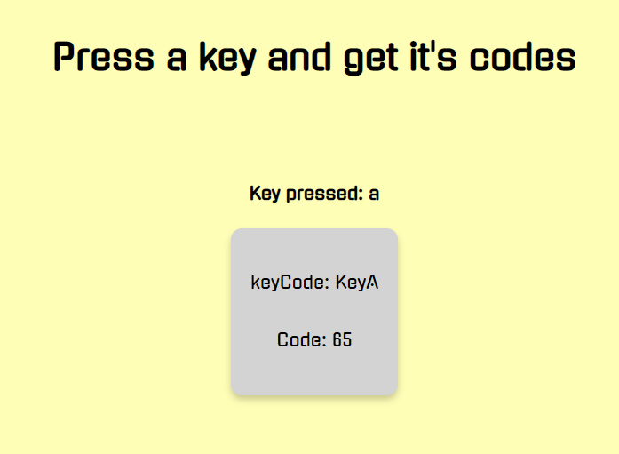

# Keyboard-KeyCodes
A mini project to find code values of key in a keyboard

## How it works

The user has to press any key on the keyboard and with that gets the `keyCode` and `code` respective to the pressed key.

## Snapshot

**Live site Url**: [keyboard-keyCodes](https://vaishakks.github.io/keyboard-keyCodes/)

## Technologies used
- HTML
- CSS
- Jquery

## References and materials 

- [Javascript Split string on UpperCase Characters](https://stackoverflow.com/questions/7888238/javascript-split-string-on-uppercase-characters)
